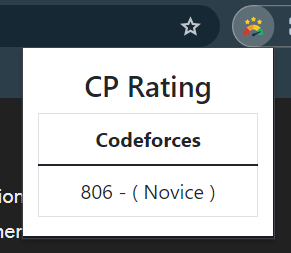

# CP Rating Chrome Extension

**Version:** 1.0.0  
**Author:** Vipin

## Description

CP Rating is a Chrome extension designed to enhance the Competitive Programming (CP) experience by providing a seamless way to view and manage Codeforces & other platforms ratings. Stay informed about your competitive programming progress with quick access to your Codeforces rating directly from the extension popup. The extension features a minimalist design for easy use, allowing you to check your Codeforces rating without leaving your current browsing session.

## Features

- View your Codeforces rating with a single click
- Minimalist design for a clean and unobtrusive user experience
- Quick access to Codeforces rating information without leaving the current tab

## Installation

1. Clone or download the repository.
2. Open Google Chrome and go to `chrome://extensions/`.
3. Enable "Developer mode" at the top right.
4. Click "Load unpacked" and select the directory containing the extension files.

## Usage

1. Click on the CF Rating extension icon in the Chrome toolbar.
2. The extension popup will display your Codeforces rating.
3. Stay updated on your competitive programming progress effortlessly.

## Screenshots

## Contributing

Basically my idea was to integrate all the competitive programming sites in one extension. But due unavailability of API's for other sites, I have to limit it to Codeforces only. But in future I will try to integrate other sites as well.
If you'd like to contribute to the development of CF Rating, please follow these guidelines. Contributions are welcome!

## Issues

If you encounter any issues or have suggestions, feel free to open an issue on the GitHub repository.

## What I Feel

I know it is very basic but i wanted to try my hands on chrome extension. I will try to make it more useful in future.

## License

This project is licensed under the [MIT License](LICENSE).

